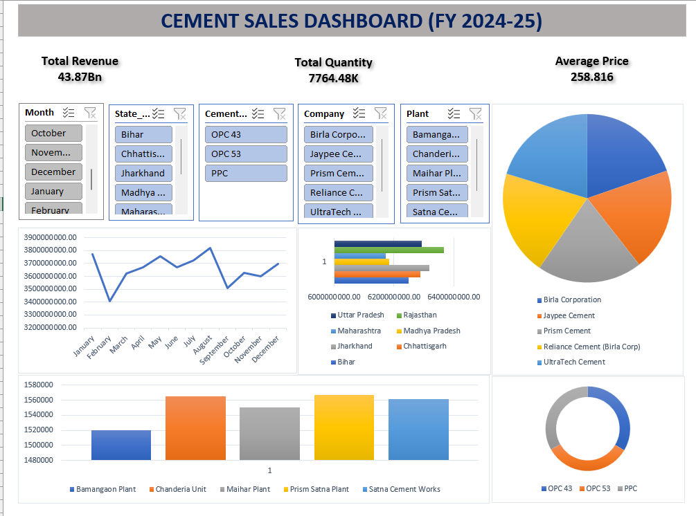

# Hi, I'm Pushpendra Patkar 👋

📊 **Aspiring Data Analyst | Excel | SQL | Power BI | Python**

I have **3+ years of experience in data operations, ETL monitoring, and reporting**. I enjoy working with data to uncover insights, build dashboards, and support business decisions.

---

## 🛠 Skills

* **Excel** – Pivot Tables, Dashboards, Advanced Formulas
* **SQL** – Joins, Aggregations, Subqueries
* **Power BI** – Data Modeling, DAX, Interactive Dashboards
* **Python** – Pandas, NumPy for Data Analysis
* **ETL Monitoring** – Informatica PowerCenter
* **ServiceNow** – Incident Management

---

# 📊 Data Analytics Projects

## 1️⃣ Cement Sales Dashboard (Excel)

This project analyzes cement sales data using Microsoft Excel.

## Project Overview
This project analyzes sales performance of cement products across different regions using Excel dashboards.

## Tools Used
- Microsoft Excel
- Pivot Tables
- Pivot Charts
- Slicers
- KPI Metrics

## Insights
- Region-wise sales performance
- Monthly sales trends
- Product category comparison
- Total revenue and quantity sold

**Description**

* Analysed regional cement sales data
* Built an interactive Excel dashboard
* Created KPIs like Total Sales, Quantity, and Dealer Performance

**Dashboard Screenshot**

## Dashboard Preview

---

## 2️⃣ E-commerce Sales Analysis (Power BI)

**Tools:** SQL, Power BI, Data Modeling

**Description**

* Analysed e-commerce sales trends
* Built KPIs like Total Revenue and Monthly Growth
* Created interactive Power BI dashboard

---

## 📚 Certifications

* Microsoft Power BI Data Analyst (PL-300)
* IBM Databases and SQL for Data Science
* Microsoft Excel Certification

---

## 📫 Connect With Me

LinkedIn: https://linkedin.com
GitHub: https://github.com/pushpendraptkr
